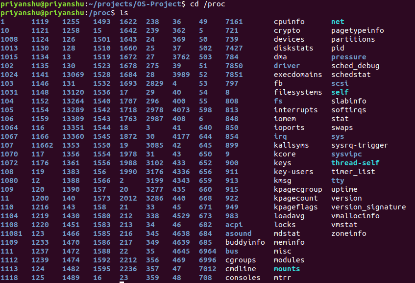
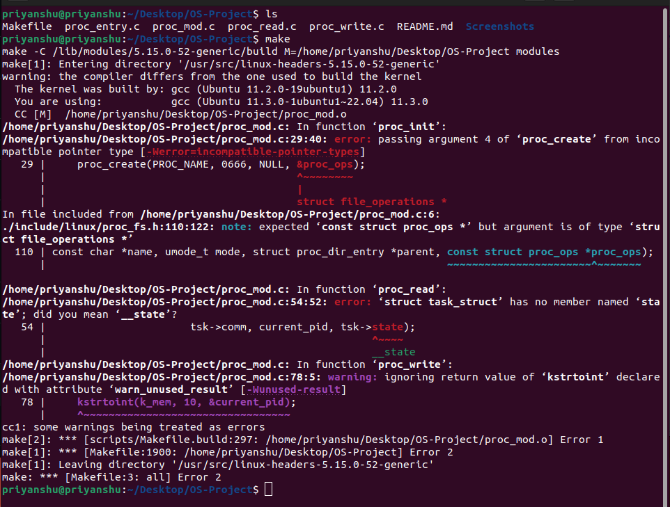
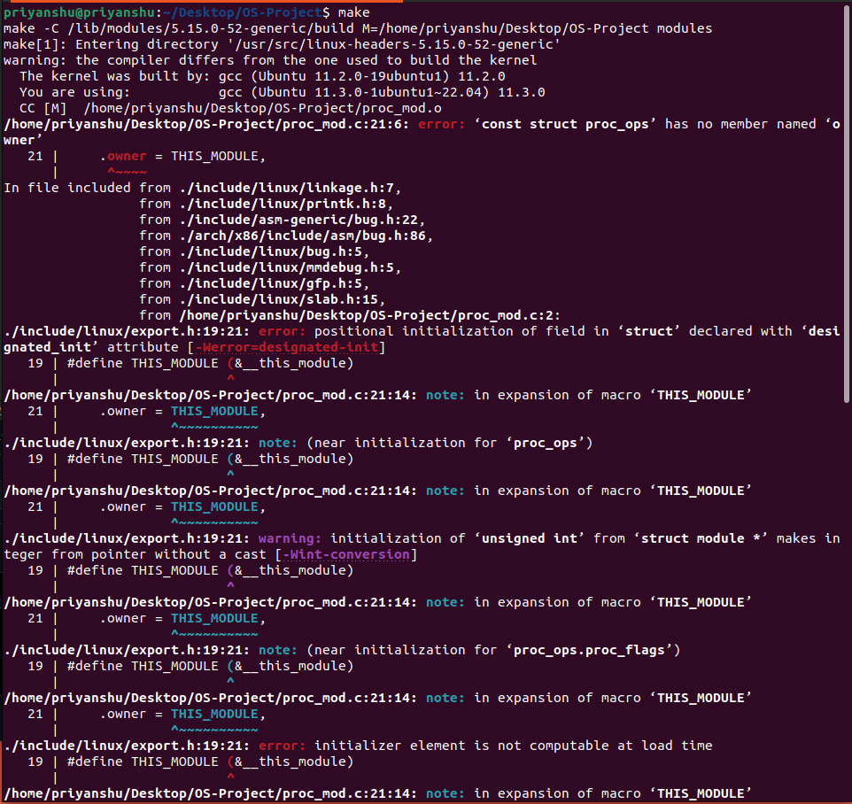

# OS-Project
Project/assignment for the CS252 Operating System course(Minors)
## Linux Kernel Module for Task Information
Linux Kernel Module for Task Information. (Operating System Concepts, 10th Edition, Chapter 3, Project 2)

### Description
This is a Linux kernel module that uses the `/proc` file system for diplaying a task's information based on it's process identifier value `pid`.

This project involves writing a process identifier to the file /proc/pid. Once a `pid` has been written to the `/proc/pid` file, subsequent reads from `/proc/pid` will report

1. the command the task is running
2. the value of the task’s `pid` 
3. the current state of the task.

### Environment

- OS: Ubuntu 18.04(Kernel version: 5.4.0-131-generic)
- Compiler: GCC 7.5.0

### Procedure
The whole project can be broken down into 3 steps:

1. Writing a process identifier to the file `/proc/pid`(Module Instantiation)
2. Writing to the `/proc` file system
3. Reading from the `/proc` file system

First we have to make an entry to the Kernel Memory to use the /proc pseudo file system. So we start with making a single module or API which runs every time we enter 
`cat /proc/pid`.
This module contains multiple functions- proc_read, proc_write, proc_init, proc_exit.

Each function serves its own purpose. `proc_init` and `proc_exit` are used to initiate the proc file system entry in the kernel

`proc_read` is used to read the `pid` values from the kernel(i.e, command of the task, value of `pid`, and current state of the task).

`proc_write` is used to store the pid value to write to the memory for future use by allocating some space

#### Makefile Generation

For Linux Kernel to operate on the module we created, it has to be converted to a `.ko` format (kernel executable file) from a `.c` file.

For this purpose we have to generate a makefile in order to convert the `.c` module to a `.ko` file. The makefile is attached above.

#### Code and Logic

Each time the `/proc/proc_mod` file is read, the `proc_read()` function is called
repeatedly until it returns 0, so there must be logic to ensure that this function returns 0 once it has collected the data.

So the final code is attached above with the name `proc_mod.c` which includes all the codes we discussed(procread, write,init, exit)

### Output

- Getting a list of valid process identifiers

- The ouput after running the module for pid = '1', '13069'

### Issues

- When we tried to run the modules given the Operating sytems(10th ed) on Ubuntu LTS 20.04, we were unable to get an executable file using the `make` command. Following was the error message -

- After changing the datatype of `proc_ops()` to `const struct proc_ops`, we got another set of errors.

- Upon further research, we found that the definition of `struct proc_ops` was recently changed in the `proc_fs.h` header file. In the [new definition](https://github.com/torvalds/linux/blob/master/include/linux/proc_fs.h) of `proc_ops()`, we no more have the methods like .write, .read and hence are unable to run the programs provided in the textbook. To get past this issue, we decided to use older version of Ubuntu. After using Ubuntu 18.04, the issue was resolved.
